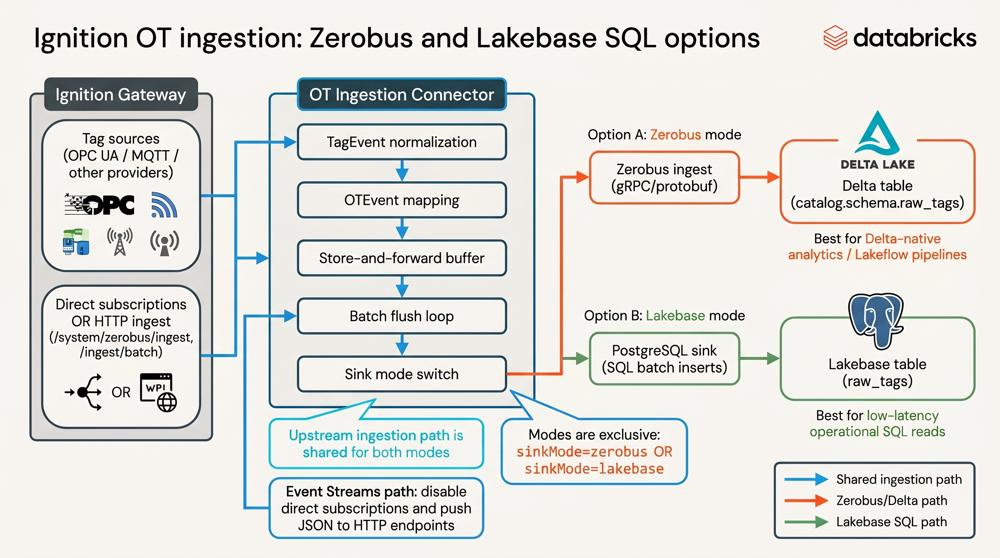

# Ignition OT Ingestion Connector

Functional Ignition module for OT ingestion into Databricks with two exclusive sink modes:

- `zerobus`: Zerobus ingest -> Delta table
- `lakebase`: PostgreSQL sink -> Lakebase table

## Module-first scope

The primary ingestion capability is in:

- `module/` - Ignition module source
- `releases/` - prebuilt `.modl` artifacts
- `DEPLOYMENT.md` - install/configure/verify runbook
- `docker/ignition-gateway/` - optional local gateway runtime

This module ingests OT events directly from Ignition through the connector runtime.

## Architecture

Shared event path:

1. Event input from Ignition direct subscriptions or HTTP ingest
2. `TagEvent` normalization
3. `OTEvent` mapping
4. store-and-forward buffer and batch flush
5. delivery to configured sink

## Install

Choose the artifact matching your Ignition version:

- Ignition 8.1.x -> `releases/zerobus-connector-1.0.10.modl`
- Ignition 8.3.x -> `releases/zerobus-connector-1.0.10-ignition-8.3.modl`

Install from Gateway UI:

- Configure -> Modules -> Install/Upgrade

## Configure

Use either:

- Gateway UI: `/system/zerobus/configure`
- REST API: `/system/zerobus/config`

Key configuration areas:

- Databricks workspace and auth
- sink mode (`zerobus` or `lakebase`)
- direct subscriptions vs HTTP ingest-only mode
- batching, buffering, backpressure, and optional numeric compression

For full validation steps, use `DEPLOYMENT.md`.

## Ingestion modes

- **Direct subscriptions**: module subscribes to Ignition tags and ingests changes.
- **HTTP ingest-only**: set direct subscriptions OFF and POST events to:
  - `POST /system/zerobus/ingest`
  - `POST /system/zerobus/ingest/batch`

## Sink modes

- **`sinkMode=zerobus`**
  - `enableZerobusSink=true`
  - `enablePostgresSink=false`
  - destination is Delta via Zerobus ingest

- **`sinkMode=lakebase`**
  - `enableZerobusSink=false`
  - `enablePostgresSink=true`
  - destination is Lakebase via SQL batch inserts

## Naming

The historical "Zerobus connector" name reflects the original destination. Current behavior is a dual-sink OT ingestion connector (`zerobus` + `lakebase`).
