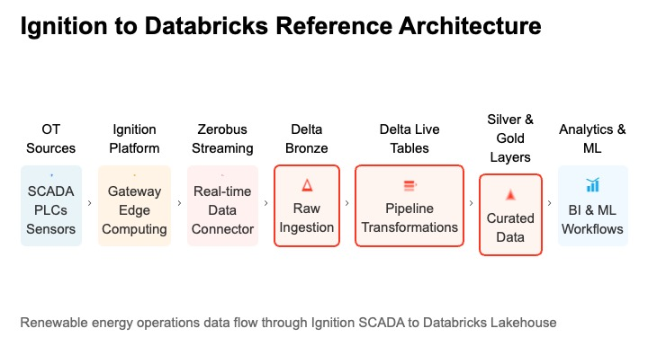

## Ignition Zerobus Connector

**Version**: `1.0.10`  
**Purpose**: Stream Ignition tag-change events to Databricks Delta tables via Zerobus (gRPC + protobuf).  
**Ignition compatibility**: **8.1.x** and **8.3.x** (different `.modl` artifacts).  
**Configuration**: via the **Ignition Gateway UI**.

### Core vs optional components

- **Core functionality** is the Ignition module under `module/` and onboarding/table setup under `onboarding/`.
- The generic visualization app scaffold under `tools/optional_apps/generic_metrics_app/` is **optional** and **not required** to run or deploy the connector.
- The optional app is intended for fork-level workflows (for example `pravinva`) and should be treated as non-core.

## Concepts (Ignition Gateway + Databricks Zerobus)

### What is an Ignition Gateway?

An **Ignition Gateway** is the runtime server for the Ignition platform. It connects to industrial data sources (OPC UA, MQTT, PLC drivers, etc.), exposes those values as **tags**, and runs gateway services (history, alarming, scripting, eventing). This module runs inside the Gateway as an Ignition module (`.modl`).

### What is Databricks Zerobus, and why use it?

**Databricks Zerobus** is Databricks’ managed real-time ingestion transport used to stream events into Delta (typically landing in a **Bronze** table).

Using Zerobus means you get a **streaming ingestion path without operating Kafka infrastructure**:
- no standing up brokers/zookeepers/controllers
- no partition planning / retention management
- no connector fleet management

Instead, this module batches tag-change events and streams them directly to Databricks over gRPC/protobuf.

## Source-agnostic by design (OPC UA, MQTT, and more)

This connector is **agnostic to the underlying OT/IIoT source** because it subscribes to **Ignition tags**, not to a specific protocol.

- **Ignition normalizes sources into tags**: Whether values originate from **OPC UA**, **MQTT**, PLC drivers, historians, or other tag providers, Ignition exposes them through the same Tag system and emits the same tag-change callbacks.
- **Stable event schema**: The module converts a tag change into a single protobuf message (see `module/src/main/proto/ot_event.proto`). Since the event payload is **about the tag observation** (tag path, timestamp, value, quality, etc.), **you do not change protobuf/schema when you switch protocols**—you only change which tag paths you subscribe to.

### What changes when you switch sources?

Only the **tag provider** (the left-most portion of the tag path) and the tag paths you select.

Examples (illustrative):
- **OPC UA tags**:
  - `[MyOpcUa]Devices/Turbine1/Speed`
  - `[MyOpcUa]Devices/Turbine1/Temperature`
- **MQTT tags (via MQTT Engine / Transmission providers)**:
  - `[MQTT Engine]Sparkplug B/Group/Edge Node/Device/pressure`
  - `[MQTT Engine]Sparkplug B/Group/Edge Node/Device/vibration_rms`
- **Simulated/demo tags**:
  - `[Sample_Tags]Sine/Sine0`
  - `[Sample_Tags]Ramp/Ramp0`

In all cases, the connector publishes **the same protobuf event type** to Databricks and writes into the same Delta table schema.

## Reference architecture



## Table of contents

- [Get started (download the module)](#get-started-download-the-module)
- [Create Databricks tables (so you can ingest data)](#create-databricks-tables-so-you-can-ingest-data)
- [Generate example tag-change data (Ignition)](#generate-example-tag-change-data-ignition)
- [Repository layout](#repository-layout)
- [Important recent changes](#important-recent-changes)
- [Release artifacts (two `.modl` files)](#release-artifacts-two-modl-files)
- [Developer build](#developer-build)
- [Reference](#reference)

For production setup (prereqs, install, configure, verify, troubleshooting), see `DEPLOYMENT.md`.

## Get started (download the module)

Download the prebuilt Ignition module (`.modl`) from GitHub Releases:

- **Ignition 8.1.x**: `zerobus-connector-1.0.10.modl`
- **Ignition 8.3.x**: `zerobus-connector-1.0.10-ignition-8.3.modl`

Then follow `DEPLOYMENT.md` for installation and configuration.

## Create Databricks tables (so you can ingest data)

Before the connector can write, you must create the **target Bronze Delta table** in Unity Catalog and enable it for Zerobus ingest.

### Option A (recommended): run the provided Databricks notebook

Import and run `onboarding/databricks/01_create_tables.py` in Databricks. In the first cell, set:
- `CATALOG`, `SCHEMA`
- `SERVICE_PRINCIPAL_UUID` (optional, for grants)

It creates:
- **Bronze ingestion table**: `<catalog>.<schema>.ot_events_bronze`
  - schema matches `module/src/main/proto/ot_event.proto`
  - sets `TBLPROPERTIES('delta.enableZerobus'='true', ...)`
- optional Silver scaffolding tables/views for mapping + normalization

### Option B: use the SQL packs in `tools/`

This repo includes end-to-end Databricks SQL packs under `tools/` (Bronze → Silver → Gold patterns + sample dashboards/prompts). Start from:
- `tools/databricks_end2end_tilt/`
- `tools/databricks_end2end_sg/`

## Generate example tag-change data (Ignition)

If you want a repeatable demo stream, use the `examples/` folders:
- **Tags**: `*_tags.json` (Ignition tag definitions)
- **Timer scripts**: `timer_script_*_orchestrator.py` (periodic tag writes to simulate telemetry)

Once tags are changing in Ignition and the module is configured, you should see rows landing in your Bronze table.

## Note on Alpha Vantage

This connector repo does **not** use Alpha Vantage. (Alpha Vantage only appears in the separate Treasury/PPNR demo repo where yield curves are backfilled into Unity Catalog.)

## Repository layout

Canonical locations:
- **Module source/build**: `module/`
- **Published module artifacts (`.modl`)**: `releases/` (repo root)

Directory structure (high-level):

```text
.
├── README.md
├── DEPLOYMENT.md
├── releases/                       # canonical .modl artifacts (root)
│   ├── zerobus-connector-1.0.10.modl
│   └── zerobus-connector-1.0.10-ignition-8.3.modl
├── module/                         # Ignition module source + Gradle build
│   ├── build.gradle
│   ├── settings.gradle
│   ├── gradlew
│   └── src/
│       └── main/
│           ├── java/               # gateway hooks, services, servlet layer
│           ├── resources/          # module.xml, i18n, UI assets (web/, mounted/)
│           └── proto/              # protobuf schema (ot_event.proto)
├── examples/                        # end-to-end demo simulations (Ignition tags + timer scripts)
│   ├── tilt_renewables_site01/
│   ├── saint_gobain_site01/
│   └── tilt_sim/
├── tools/                           # Databricks SQL packs (Bronze→Silver→Gold) + dashboard/genie prompts
│   ├── databricks_end2end_tilt/
│   └── databricks_end2end_sg/
│   └── optional_apps/
│       └── generic_metrics_app/     # optional Databricks app scaffold (non-core)
└── onboarding/
    ├── databricks/                 # optional: helper to create/align target table schema
    └── ignition/
        ├── 8.1.50/README.md
        └── 8.3.2/README.md
```

## Important recent changes

- **Proto presence semantics**: `module/src/main/proto/ot_event.proto` now uses proto3 `optional` on value/quality/alarm fields to preserve explicit default values (for example `0`, `false`, empty string).
- **Optional OT event telemetry fields** added to schema:
  - `sdt_compressed`, `compression_ratio`, `sdt_enabled`, `batch_bytes_sent`
- **Edge latency metrics added** in `TagSubscriptionService` diagnostics/metrics snapshot:
  - ingest latency, queue latency, and end-to-end latency (avg/p95/p99/max)
- **Table setup updated**: `onboarding/databricks/01_create_tables.py` includes the new optional telemetry columns in Bronze DDL.

## Release artifacts (two `.modl` files)

There are **two** prebuilt module packages under `releases/`:

- **`releases/zerobus-connector-1.0.10.modl`**:
  - **Install on**: Ignition **8.1.x** (and 8.2.x if you run it)
  - **Why**: the packaged `module.xml` sets `<requiredIgnitionVersion>` to `8.1.0`

- **`releases/zerobus-connector-1.0.10-ignition-8.3.modl`**:
  - **Install on**: Ignition **8.3.x**
  - **Why**: the packaged `module.xml` sets `<requiredIgnitionVersion>` to `8.3.0`

### What’s different between them?

Ignition enforces compatibility based on `module.xml` during install. Because 8.3 refuses modules whose `requiredIgnitionVersion` is below 8.3, we ship two `.modl` artifacts.

The **runtime behavior and code are the same**; the important differences are:

- **`module.xml` gate**: different `<requiredIgnitionVersion>` value, produced by the Gradle `-PminIgnitionVersion=...` build flag.
- **Servlet API at runtime**:
  - Ignition 8.1 uses **`javax.servlet`**
  - Ignition 8.3 uses **`jakarta.servlet`**
  - The module includes both servlet implementations and selects the right one at runtime via `module/src/main/java/com/example/ignition/zerobus/web/ZerobusConfigServlet.java`.

## Developer build

### 1) Prerequisites (local dev machine)

- **JDK 17** installed (Gradle/tooling).
- **Ignition SDK jars available locally** (used as `compileOnly` dependencies):
  - **8.1.x** install at: `/usr/local/ignition8.1`
  - **8.3.x** install at: `/usr/local/ignition`

### 2) Code flow explainer (runtime)

#### 2.1) High-level architecture

Two ways for events to enter the module:
- **Direct subscriptions** (recommended): in-JVM tag change callbacks from Ignition’s TagManager
- **HTTP ingest** (ingest-only mode): external producer POSTs JSON to module endpoints

One way for events to leave the module:
- **Zerobus ingest over gRPC/protobuf** to the Databricks Zerobus endpoint

#### 2.2) Pipeline components (architectural separation)

The runtime data path is built as a small pipeline:

- **Mapper**: `TagEvent → OTEvent` (`module/src/main/java/com/example/ignition/zerobus/pipeline/OtEventMapper.java`)
- **Buffer**: commit-based buffer backed by memory or disk (`module/src/main/java/com/example/ignition/zerobus/pipeline/StoreAndForwardBuffer.java`)
- **Sink**: Zerobus write boundary (`module/src/main/java/com/example/ignition/zerobus/pipeline/EventSink.java`)
  - Zerobus implementation: `ZerobusEventSink` → `ZerobusClientManager.sendOtEvents(...)`

#### 2.2) Lifecycle and configuration

**Startup**
- Gateway hook entrypoints:
  - Ignition **8.1.x**: `com.example.ignition.zerobus.ZerobusGatewayHook`
  - Ignition **8.3.x**: `com.example.ignition.zerobus.ZerobusGatewayHook83`
- PersistentRecord schema is registered (tables created if missing).
- Configuration is loaded from the Gateway internal DB into `com.example.ignition.zerobus.ConfigModel`.
- Services start **only if** configuration is valid enough to run (and module is enabled). Invalid config **does not fault the module**; it keeps services stopped and exposes the error in diagnostics.

**Save/apply configuration**
- New values are persisted to PersistentRecord.
- Runtime `ConfigModel` is updated (`updateFrom(...)`).
- Services are restarted only if necessary (and without crashing the module on validation errors).
- OAuth client secret is stored in the Gateway internal DB (masked in UI); leaving it blank preserves the existing value.

#### 2.3) Data path: Direct subscriptions mode

1) **Tag change happens**: Ignition calls into the module via TagManager subscription callbacks.  
2) **Normalize**: `TagSubscriptionService` builds a `TagEvent`, then maps it to `OTEvent` via `OtEventMapper`.  
3) **Buffer**: the `OTEvent` is offered to the buffer (memory or disk store-and-forward).  
4) **Flush loop**: a scheduled flusher runs every `batchFlushIntervalMs`. When the sink is ready, it drains up to `batchSize` events and calls the sink.  
5) **Commit semantics**: the buffer is committed only after a successful send (at-least-once).  

#### 2.4) Data path: HTTP ingest mode (ingest-only)

Prerequisite: set **Enable Direct Subscriptions** = OFF in the module UI.

1) **Producer POSTs JSON**:
   - `POST /system/zerobus/ingest` (single)
   - `POST /system/zerobus/ingest/batch` (batch)
2) **Servlet routes the request**:
   - `.../web/ZerobusConfigServlet` (dispatcher)
   - `.../web/ZerobusServletHandler` (shared request parsing/routing)
3) **Normalize + buffer**: payload → `TagEvent` → `OTEvent` → buffer.
4) **Batch/flush/send**: same flush loop and sink as direct subscriptions.

### 2.5) Store-and-forward + backpressure + “sink down” behavior

When **Store-and-Forward** is enabled:

- Events are buffered to disk (`DiskSpool`) and only removed after successful send (commit).
- The module applies high/low watermark backpressure:
  - When spool backlog exceeds **high watermark**, direct subscriptions auto-pause (unsubscribe) and new events may be rejected (instead of unbounded growth).
  - When backlog drops below **low watermark**, direct subscriptions auto-resume.

When the **sink is down** (auth/network outages):

- **Ingestion continues** (events keep buffering).
- The flusher **does not drain disk** unless the sink is ready (prevents repeatedly reading/parsing the same records while disconnected).
- Once auth/network recovers, the sink reconnects, the backlog drains, and subscriptions resume.

### 3) Build artifacts

#### 3.1) Build the Ignition 8.1.x module (`.modl`)

```bash
cd module
JAVA_HOME=/opt/homebrew/opt/openjdk@17 PATH=/opt/homebrew/opt/openjdk@17/bin:$PATH \
  ./gradlew buildModule81
```

Output: `module/build-user-8.1/modules/zerobus-connector-1.0.10.modl`

#### 3.2) Build the Ignition 8.3.x module (`.modl`)

```bash
cd module
JAVA_HOME=/opt/homebrew/opt/openjdk@17 PATH=/opt/homebrew/opt/openjdk@17/bin:$PATH \
  ./gradlew buildModule83
```

Output: `module/build-user-8.3/modules/zerobus-connector-1.0.10-ignition-8.3.modl`

#### 3.3) Where release artifacts go

After building, the Gradle task also copies the `.modl` into the repo-level `releases/` directory.

### 3.4) Module ID override (Module Showcase / alternate namespaces)

By default, the module ID is:
- `com.example.ignition.zerobus`

To build a `.modl` with a different module ID (for example, to publish under a Module Showcase namespace),
pass `-PmoduleId=...`:

```bash
cd module
./gradlew buildModule83 -PmoduleId=com.databricks.ignition.zerobus
```

**Note**: Changing module ID means Ignition treats it as a **different module** (no in-place upgrade/migration).

### 3.5) Signing `.modl` artifacts (for distribution)

Ignition modules should be **signed** for distribution.
This repo supports signing as an **optional** build step, without hardcoding any secrets.

You will need Inductive Automation’s `module-signer.jar` (see IA SDK docs on module signing) and a keystore.

Provide signing config via Gradle properties or environment variables:

- `MODULE_SIGNER_JAR` (or `-PmoduleSignerJar=...`)
- `SIGNING_KEYSTORE` (or `-PsigningKeystore=...`)
- `SIGNING_STOREPASS` (or `-PsigningKeystorePassword=...`)
- `SIGNING_ALIAS` (or `-PsigningAlias=...`)
- `SIGNING_KEYPASS` (or `-PsigningAliasPassword=...`)
- Optional: `SIGNING_CHAIN` (or `-PsigningChain=...`) for CA-signed cert chains

Then run:

```bash
cd module
./gradlew signModule83
./gradlew signModule81
```

The signer outputs a new file next to the unsigned module with a `-signed.modl` suffix.

### 3.5) Run unit tests (8.1 vs 8.3 SDK jars)

Gradle needs to know which local Ignition SDK jars to compile against. Run tests like:

**Ignition 8.1**

```bash
cd module
./gradlew test -PignitionHome=/usr/local/ignition8.1 -PbuildForIgnitionVersion=8.1.50
```

**Ignition 8.3**

```bash
cd module
./gradlew test -PignitionHome=/usr/local/ignition -PbuildForIgnitionVersion=8.3.2
```

#### 3.4) Docker-based build (optional)

If you don’t want to install Ignition locally just to access SDK jars, you can build the `.modl` in Docker using:
- the official `inductiveautomation/ignition` image (source of Ignition SDK/runtime jars)
- an official Java 17 JDK image (`eclipse-temurin:17-jdk`) for the Gradle build

If you want to run a full **Ignition Gateway** in Docker (for demos, without installing Ignition on your laptop),
see `docker/ignition-gateway/README.md` (Colima on macOS).

This uses BuildKit `--output` to write the `.modl` to a local folder:

**Ignition 8.3.x**

```bash
DOCKER_BUILDKIT=1 docker build -f docker/Dockerfile.build-modl \
  --target out \
  --build-arg IGNITION_TAG=8.3 \
  --build-arg BUILD_FOR_IGNITION_VERSION=8.3.2 \
  --build-arg MIN_IGNITION_VERSION=8.3.0 \
  --output type=local,dest=./docker-out/8.3 \
  .
```

**Ignition 8.1.x**

```bash
DOCKER_BUILDKIT=1 docker build -f docker/Dockerfile.build-modl \
  --target out \
  --build-arg IGNITION_TAG=8.1 \
  --build-arg BUILD_FOR_IGNITION_VERSION=8.1.50 \
  --build-arg MIN_IGNITION_VERSION=8.1.0 \
  --output type=local,dest=./docker-out/8.1 \
  .
```

If the Ignition image uses a different install root than `/usr/local/ignition`, pass:

```bash
--build-arg IGNITION_HOME=/path/inside/container
```

### 4) Local testing (run Ignition gateways)

#### 4.1) Install prerequisites

- Install **Ignition 8.1.x** and/or **Ignition 8.3.x** locally.
- Install **JDK 17** (required for building the module).

#### 4.2) Where the Gateway port is configured

On a default local install, the HTTP port is configured in:
- **Ignition 8.3.x**: `/usr/local/ignition/data/ignition.conf`
- **Ignition 8.1.x**: `/usr/local/ignition8.1/data/ignition.conf`

To see what port is currently set:

```bash
grep -E '^(webserver\\.http\\.port|webserver\\.https\\.port)=' /usr/local/ignition/data/ignition.conf
grep -E '^(webserver\\.http\\.port|webserver\\.https\\.port)=' /usr/local/ignition8.1/data/ignition.conf
```

#### 4.3) Start / stop / status commands

Ignition installs include an `ignition.sh` control script:

```bash
# Ignition 8.3.x
/usr/local/ignition/ignition.sh start
/usr/local/ignition/ignition.sh stop
/usr/local/ignition/ignition.sh status

# Ignition 8.1.x
/usr/local/ignition8.1/ignition.sh start
/usr/local/ignition8.1/ignition.sh stop
/usr/local/ignition8.1/ignition.sh status
```

If you run into permissions errors starting/stopping, run the same commands with `sudo`.

## Reference

### API endpoints

All endpoints are under `/system/zerobus`:
- `GET /health`
- `GET /configure` (HTML config + diagnostics page)
- `GET /diagnostics`
- `GET /metrics/compression` (SDT/deadband rolling stats + top tags, JSON)
- `POST /config`
- `POST /test-connection`
- `POST /ingest` (single JSON event)
- `POST /ingest/batch` (JSON array of events)

### Edge compression (deadband + SDT)

This connector can reduce numeric event volume **at the edge** (in the Ignition module) before sending to Zerobus/Delta.

#### Modes

Configured by `numericCompressionMode`:

- `NONE`: send all values (no filtering)
- `DEADBAND`: send numeric values only when \(|Δ| > deadband\); non-numerics use “only on change”
- `SDT`: PI-like **Swinging Door Trending** with:
  - `numericSdtDeviation` (engineering units)
  - `numericSdtMaxIntervalMs` (force a point at least every N ms; 0 disables)

Backward compatibility:
- If `numericCompressionMode` is unset (null/empty), the effective mode is derived from legacy `onlyOnChange`:
  - `onlyOnChange=true` ⇒ `DEADBAND`
  - `onlyOnChange=false` ⇒ `NONE`

#### Per-tag defaults (multi-variable deadband, and per-signal SDT)

You can configure different defaults for different tag types (temperature vs pressure vs flow) using regex rules.

- **Legacy per-tag deadband rules** (already implemented earlier): `numericDeadbandRules[]`
  - Each rule has `tagPathRegex` and `deadband`
  - First match wins; falls back to global `numericDeadband`

- **Preferred unified rules**: `numericCompressionRules[]`
  - Each rule has `tagPathRegex` and can set:
    - `mode`: `NONE | DEADBAND | SDT`
    - `deadband` (when mode=DEADBAND)
    - `sdtDeviation`, `sdtMaxIntervalMs` (when mode=SDT)
  - First match wins; falls back to global settings

Notes:
- The Ignition 8.1 HTML config page currently exposes the global SDT fields.
- Rule lists (`numericDeadbandRules`, `numericCompressionRules`) are configured by `POST /system/zerobus/config` (JSON).

Example (illustrative):

```json
{
  "numericCompressionMode": "SDT",
  "numericSdtDeviation": 0.2,
  "numericSdtMaxIntervalMs": 600000,
  "numericCompressionRules": [
    { "tagPathRegex": ".*(Temp|Temperature|_C$|/Thermal/).*", "mode": "SDT", "sdtDeviation": 0.2, "sdtMaxIntervalMs": 600000 },
    { "tagPathRegex": ".*(Pressure|_bar$|_kPa$|/Pressure/).*", "mode": "SDT", "sdtDeviation": 0.05, "sdtMaxIntervalMs": 300000 },
    { "tagPathRegex": ".*(Flow|_m3h$|/Flow/).*", "mode": "SDT", "sdtDeviation": 2.0, "sdtMaxIntervalMs": 300000 }
  ]
}
```

### Key classes

- **`module/src/main/java/com/example/ignition/zerobus/ZerobusGatewayHook.java`**: module lifecycle; loads/saves config; starts/stops services; registers HTTP endpoints under `/system/zerobus/*`.
- **`module/src/main/java/com/example/ignition/zerobus/TagSubscriptionService.java`**: tag event processing:
  - direct mode subscriptions via TagManager
  - HTTP ingest queueing via `/ingest` and `/ingest/batch`
  - batching + rate limiting + flush loop
- **`module/src/main/java/com/example/ignition/zerobus/ZerobusClientManager.java`**: manages Zerobus client; converts events to protobuf and streams to Databricks.
- **Servlet compatibility layer**:
  - `.../web/ZerobusConfigServlet.java` selects `javax` vs `jakarta` servlet implementation at runtime.
  - `.../web/ZerobusServletHandler.java` holds shared request parsing and routing.
- **Schema**: `module/src/main/proto/ot_event.proto`

### End-to-end data flow

**Direct subscriptions**
1) Tag change event → `TagSubscriptionService` listener  
2) Convert to internal `TagEvent` → queue  
3) Flush loop batches → `ZerobusClientManager`  
4) Protobuf (OTEvent) → Zerobus stream → Delta

**HTTP ingest (Event Streams / external producer)**
1) Producer POSTs JSON → `/system/zerobus/ingest` or `/ingest/batch`  
2) Handler parses + enqueues `TagEvent`s  
3) Batching + streaming as above
