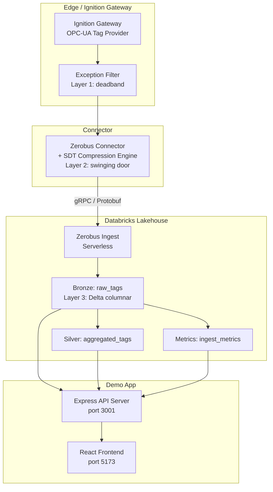

# AGL OT Lakehouse Demo

Live demonstration of streaming industrial OT data from Ignition to Databricks Delta Lake via Zerobus, with Swinging Door Trending (SDT) compression at the connector layer.

**Connector highlights (current `main`):**

- **SDT observability** — per-tag SDT compression ratio flows into events (`ot_event.proto`) and aggregate metrics for the Gateway UI.
- **Gateway UI** — Zerobus configuration page uses Databricks-aligned styling (`module/src/main/resources/web/zerobus-config.html`).
- **Zerobus stream recovery** — flusher avoids deadlocks when the gRPC stream is in a recovering state (`ZerobusClientManager`).
- **Workshop bundle** — `workshop/databricks.yml` deploys medallion workshop SQL/assets via Databricks Asset Bundles (adjust `workspace` / variables for your profile).

## Architecture



## Prerequisites

- Node.js 20+
- A Databricks workspace with Unity Catalog and a SQL Warehouse
- Zerobus Ingest endpoint (Public Preview)

## End-to-end demo (Makefile)

For the full **Ignition 8.3** gateway (Docker), **Databricks** bundle deploy, and **synthetic tag** traffic from the repo root, use Make. Step-by-step commands, reruns, and resets are in **[docs/make-workflow.md](docs/make-workflow.md)**.

Quick path:

```bash
make bootstrap-83
make setup-wizard-83 configure-83 simulate-83 links-83
```

Run `make help` from the repo root for all targets. Deeper tables and troubleshooting: [CLAUDE.md](CLAUDE.md).

## Setup

1. Clone the repository. Use **`main`** for the latest connector and demo stack; use **`agl-demo`** for a stable AGL fleet–focused snapshot:
   ```bash
   git clone <repo-url>
   git checkout main
   ```

2. Copy `.env.example` to `.env` and fill in your credentials:
   ```bash
   cp demo/.env.example demo/.env
   ```

3. Install dependencies for each package:
   ```bash
   npm --prefix demo/frontend install
   npm --prefix demo/simulator install
   ```

4. Create the Databricks tables by running `pipelines/sql/setup_tables.sql` against your SQL Warehouse. Replace `${catalog}` and `${schema}` with your values (defaults: `agl_demo.ot`).

5. Start the frontend:
   ```bash
   npm --prefix demo/frontend run dev
   ```

7. Start the simulator:
   ```bash
   npm --prefix demo/simulator run dev
   ```

## Environment variables

| Variable | Required | Default | Description |
|---|---|---|---|
| `DATABRICKS_HOST` | Yes | - | Workspace URL |
| `DATABRICKS_TOKEN` | Auth* | - | PAT or OAuth token (local dev) |
| `DATABRICKS_CLIENT_ID` | Auth* | - | Service principal client ID (Databricks Apps) |
| `DATABRICKS_CLIENT_SECRET` | Auth* | - | Service principal client secret (Databricks Apps) |
| `DATABRICKS_HTTP_PATH` | Yes | - | SQL warehouse HTTP path |
| `DATABRICKS_WAREHOUSE_ID` | No | - | SQL warehouse ID (injected by app.yaml) |
| `DATABRICKS_CATALOG` | No | `agl_demo` | Unity Catalog name |
| `DATABRICKS_SCHEMA` | No | `ot` | Schema name |
| *Auth note* | | | Use either `DATABRICKS_TOKEN` or both `DATABRICKS_CLIENT_ID` + `DATABRICKS_CLIENT_SECRET` for Databricks SQL / Apps. |
| `ZEROBUS_ENDPOINT` | No | - | Zerobus gRPC endpoint |
| `ZEROBUS_CLIENT_ID` | No | - | OAuth client ID |
| `ZEROBUS_CLIENT_SECRET` | No | - | OAuth client secret |
| `ZEROBUS_TABLE` | No | - | Target Delta table FQN |
| `SDT_DEFAULT_COMP_DEV_PERCENT` | No | `1.0` | Default SDT compression deviation % |
| `SDT_DEFAULT_COMP_MAX_SECONDS` | No | `600` | Default max archive interval (seconds) |

## Project structure

```
demo/             Databricks demo application
  frontend/       React 18 + Vite + Tailwind CSS dashboard
  backend/        Express API server with Databricks SQL connector
  simulator/      Ignition tag simulator + Zerobus publisher
  app/            Databricks Apps deployment config (app.yaml)
pipelines/        Databricks data processing
  sql/            SQL scripts for table setup and transforms (Bronze → Silver → Gold)
  sites/          Per-customer site SQL packs
module/           Java Ignition Gateway module (separate build)
workshop/         Databricks bundle (medallion workshop file sync); see workshop/databricks.yml
examples/         Ignition site configurations
docker/           Docker build and gateway configs
```

## Quick start (demo app only)

```bash
cd demo && npm run demo:start
```

This single command verifies `.env` is configured, then starts the backend, frontend, and simulator concurrently.

## Demo deployment — full end-to-end (Ignition + Zerobus + Databricks)

This is the complete local deployment flow for running the demo from scratch. It sets up an Ignition Gateway in Docker, auto-configures the Zerobus connector, and streams simulated industrial data to Databricks.

### Prerequisites

- **Docker** — via [Colima](https://github.com/abiosoft/colima) (macOS, **recommended**: `colima start --memory 10 --cpu 4`) or Docker Desktop
- **uv** — Python package manager ([install](https://docs.astral.sh/uv/))
- A **Databricks workspace** with Unity Catalog, a SQL Warehouse, and Zerobus Ingest enabled
- A **Databricks service principal** with OAuth M2M credentials (Client ID + Client Secret)
- A `~/.databrickscfg` profile configured for the service principal:

```ini
[my-demo]
host          = https://adb-<workspace-id>.<suffix>.azuredatabricks.net
client_id     = <service-principal-client-id>
client_secret = <service-principal-client-secret>
auth_type     = oauth-m2m
```

### Step 1 — Set up Databricks tables and permissions

Run the setup SQL against your workspace (update catalog/schema/SP ID as needed):

```bash
# Using the Databricks CLI
databricks sql execute --profile my-demo \
  --statement "CREATE CATALOG IF NOT EXISTS my_catalog"

# Or run the full setup script
# See examples/agl_fleet/setup_databricks.sql for the complete set of
# CREATE/GRANT statements needed for the service principal
```

The service principal needs `USE CATALOG`, `USE SCHEMA`, `MODIFY`, and `SELECT` on the target table. See `examples/agl_fleet/setup_databricks.sql` for a working example.

### Step 2 — Start the Ignition Gateway in Docker

```bash
cd docker/ignition-gateway
docker compose -f docker-compose.83.yml up -d
```

Wait for the container to be healthy (~60s on first boot):

```bash
docker ps --filter name=ignition83_7088 --format '{{.Status}}'
# Should show: Up ... (healthy)
```

On first boot, complete the setup wizard at `http://localhost:7088`:
1. Accept the EULA
2. Create an admin user (e.g. `admin` / `password`)
3. Skip edition selection (trial is fine)
4. Finish setup

The Zerobus module is auto-loaded from the bind-mounted `.modl` file.

### Step 3 — Auto-configure the Zerobus module

```bash
cd examples/agl_fleet

# One command: reads credentials from your Databricks CLI profile
# and pushes the full connection config to the running Gateway
uv run --extra setup agl-sim --setup-only \
    --profile my-demo \
    --zerobus-endpoint <workspace-id>.zerobus.<region>.<cloud-domain>
```

This uses a GET-then-merge approach, so it won't overwrite other settings. You can also configure manually via `curl` — see `DEPLOYMENT.md` for the full REST API reference.

Verify the connection:

```bash
# Health check — should return {"status":"ok","enabled":true}
curl -s http://localhost:7088/system/zerobus/health

# Full diagnostics — look for Connected: true
curl -s http://localhost:7088/system/zerobus/diagnostics
```

### Step 4 — Run the simulator

```bash
cd examples/agl_fleet
uv sync
uv run agl-sim --gateway http://localhost:7088
```

You should see events being accepted with `dropped=0`:

```
[tick 1] sent=48 accepted=48 dropped=0
[tick 2] sent=39 accepted=39 dropped=0
```

### Step 5 — Verify data in Databricks

```sql
SELECT COUNT(*) AS row_count,
       MIN(ingestion_timestamp) AS earliest,
       MAX(ingestion_timestamp) AS latest
FROM <catalog>.<schema>.<table>
WHERE ingestion_timestamp >= current_timestamp() - INTERVAL 10 MINUTES;
```

### Teardown

```bash
# Stop the simulator
Ctrl+C

# Stop the Gateway (preserves state for next time)
cd docker/ignition-gateway && docker compose -f docker-compose.83.yml down

# Full reset (removes volumes, requires setup wizard again)
cd docker/ignition-gateway && docker compose -f docker-compose.83.yml down -v
```

### Detailed documentation

| Topic | Document |
|-------|----------|
| Production deployment & configuration | `DEPLOYMENT.md` |
| Docker/Colima gateway setup | `docker/ignition-gateway/README.md` |
| AGL Fleet Simulator & auto-config | `examples/agl_fleet/README.md` |
| Databricks table setup & SP grants | `examples/agl_fleet/setup_databricks.sql` |
| Medallion workshop (bundle deploy) | `workshop/databricks.yml` |
| Module build from source | `CLAUDE.md` (Docker-based build section) |

## SDT compression

The Swinging Door Trending (SDT) algorithm compresses time-series data at the connector layer, matching common historian compression semantics. It works by maintaining a "door" around the last archived point - only when a new value deviates beyond the configurable CompDev threshold does it trigger an archive event.

**Two-layer compression:**

1. **SDT at the connector** - Swinging Door Trending filters out redundant values before they reach Databricks.
2. **Delta columnar encoding** - Parquet dictionary, RLE, bit-packing, and Zstd compression on top of the SDT-filtered data.

### Global SDT settings (UI)

Use the Gateway page at:

- `http://<gateway-host>:<port>/system/zerobus/configure`

In the Numeric Compression section:

- set `Numeric Compression Mode = SDT`
- set `SDT Deviation` (`numericSdtDeviation`)
- set `SDT Max Interval (ms)` (`numericSdtMaxIntervalMs`)
- set `SDT Min Interval (ms)` (`numericSdtMinIntervalMs`)

These are the global defaults applied when no per-tag override rule matches.
The current UI exposes global SDT settings only.

### Per-tag SDT rules (JSON POST)

Per-tag overrides are configured through `POST /system/zerobus/config` using `numericCompressionRules`.

Recommended flow is GET -> merge -> POST (to avoid overwriting unrelated settings):

```bash
# 1) Get current config
curl -s "http://localhost:7088/system/zerobus/config" > /tmp/zerobus-config.json

# 2) Edit /tmp/zerobus-config.json and add numericCompressionRules, then:
curl -s -X POST "http://localhost:7088/system/zerobus/config" \
  -H "Content-Type: application/json" \
  --data-binary "@/tmp/zerobus-config.json"
```

Example `numericCompressionRules` block:

```json
{
  "numericCompressionRules": [
    {
      "tagPathRegex": "^\\[default\\]AreaA/Temp/.*$",
      "mode": "SDT",
      "sdtDeviation": 0.15,
      "sdtMaxIntervalMs": 60000,
      "sdtMinIntervalMs": 1000
    },
    {
      "tagPathRegex": "^\\[default\\]AreaA/Pressure/.*$",
      "mode": "SDT",
      "sdtDeviation": 0.5,
      "sdtMaxIntervalMs": 120000,
      "sdtMinIntervalMs": 2000
    },
    {
      "tagPathRegex": "^\\[default\\]AreaA/Status/.*$",
      "mode": "DEADBAND",
      "deadband": 0.0
    }
  ]
}
```

Rule behavior:

- first matching rule wins
- regex is matched against the full tag path
- if no rule matches, global numeric compression settings are used

**Global parameter names:**

| Parameter | Description | Default |
|---|---|---|
| `numericSdtDeviation` | SDT deviation in engineering units | `0.0` |
| `numericSdtMaxIntervalMs` | Max time between forced archive events (ms) | `0` (disabled) |
| `numericSdtMinIntervalMs` | Min time between emitted events (ms) | `0` (disabled) |

Typical compression ratios range from 4:1 to 10:1 depending on signal characteristics.

The connector also tracks **per-tag SDT compression ratio** (percentage of samples suppressed vs. raw) for validation, diagnostics, and the native metrics payload surfaced in the Gateway UI.

## Running tests

```bash
npm --prefix demo/frontend run test -- --run
npm --prefix demo/simulator run test -- --run
```

## Gate verification

```bash
cd demo && bash gates.sh
```

This runs install, lint, typecheck, test, and build gates across all packages.

## Deploying to Databricks Apps

The demo app (backend + frontend) can be deployed as a Databricks App using git integration. The simulator runs separately (on-prem or locally).

### Prerequisites

- A Databricks workspace with Apps enabled
- A SQL warehouse (serverless recommended)
- The target branch (`main` or `agl-demo`) pushed to a git repo accessible from Databricks

### Steps

1. **Clone the repo into your workspace** as a Git Folder:
   - In Databricks, go to Workspace > Repos > Add Repo
   - Enter the repo URL and select **`main`** (latest) or **`agl-demo`** (AGL snapshot)

2. **Create the app** in your Databricks workspace:
   ```bash
   databricks apps create agl-ot-demo --description "AGL OT Lakehouse Demo"
   ```

3. **Add resources** - in the Databricks Apps UI, click "Configure" on the app and add a SQL warehouse resource with key `sql-warehouse`. Grant the app's service principal `CAN USE` permission on the warehouse.

4. **Deploy from workspace** - point the app at the `demo/app/` directory within the cloned repo:
   ```bash
   databricks apps deploy agl-ot-demo \
     --source-code-path /Workspace/Repos/<your-user>/lakeflow-ignition-zerobus-connector/demo/app
   ```

5. **Verify** - open the app URL shown in the deployment output. The dashboard should load and display live metrics once the simulator is sending data.

6. **Stream logs** to debug startup issues:
   ```bash
   databricks apps logs agl-ot-demo --follow
   ```

### How it works

The `demo/app/` directory contains:
- `app.yaml` - Databricks Apps configuration (command, env vars, resource references)
- `package.json` - Build and start scripts
- `scripts/copy-static.js` - Copies frontend build output for Express to serve

When deployed, Databricks Apps:
1. Runs `npm run build` which installs and builds both frontend and backend, then copies frontend assets to `demo/app/static/`
2. Runs `npm run start` (from `app.yaml` command) which starts Express serving both the API and static frontend on `$PORT`

The app's service principal automatically receives `DATABRICKS_CLIENT_ID`, `DATABRICKS_CLIENT_SECRET`, and `DATABRICKS_HOST` as environment variables. The SQL warehouse ID is injected via the `sql-warehouse` resource reference in `app.yaml`.

### Troubleshooting deployment

- **Port binding errors**: The app MUST listen on `process.env.PORT`. Do not hardcode a port.
- **Missing resources**: If `DATABRICKS_WAREHOUSE_ID` is empty, ensure the SQL warehouse resource is attached to the app.
- **Auth failures**: The app uses service principal OAuth (M2M). Verify the service principal has access to the catalog and warehouse.
- **Build failures**: Run `cd demo/app && npm run build` locally to debug build issues before deploying.
- **Frontend not loading**: Check that `demo/app/static/` is populated after build. The Express server serves these files in production mode (`NODE_ENV=production`).

---

## Ignition Zerobus Connector

**Version**: `1.0.10` (see `module/build.gradle`)
**Purpose**: Stream Ignition tag-change events to Databricks Delta tables via Zerobus (gRPC + protobuf).
**Ignition compatibility**: **8.1.x** and **8.3.x** (different `.modl` artifacts). Tag History provider features require **8.3.x**.
**Configuration**: via the **Ignition Gateway UI** (`/system/zerobus` web assets).

## Concepts (Ignition Gateway + Databricks Zerobus)

### What is an Ignition Gateway?

An **Ignition Gateway** is the runtime server for the Ignition platform. It connects to industrial data sources (OPC UA, MQTT, PLC drivers, etc.), exposes those values as **tags**, and runs gateway services (history, alarming, scripting, eventing). This module runs inside the Gateway as an Ignition module (`.modl`).

### What is Databricks Zerobus, and why use it?

**Databricks Zerobus** is Databricks' managed real-time ingestion transport used to stream events into Delta (typically landing in a **Bronze** table).

Using Zerobus means you get a **streaming ingestion path without operating Kafka infrastructure**:
- no standing up brokers/zookeepers/controllers
- no partition planning / retention management
- no connector fleet management

Instead, this module batches tag-change events and streams them directly to Databricks over gRPC/protobuf.

## Source-agnostic by design (OPC UA, MQTT, and more)

This connector is **agnostic to the underlying OT/IIoT source** because it subscribes to **Ignition tags**, not to a specific protocol.

- **Ignition normalizes sources into tags**: Whether values originate from **OPC UA**, **MQTT**, PLC drivers, historians, or other tag providers, Ignition exposes them through the same Tag system and emits the same tag-change callbacks.
- **Stable event schema**: The module converts a tag change into a single protobuf message (see `module/src/main/proto/ot_event.proto`). Since the event payload is **about the tag observation** (tag path, timestamp, value, quality, etc.), **you do not change protobuf/schema when you switch protocols** - you only change which tag paths you subscribe to.

### What changes when you switch sources?

Only the **tag provider** (the left-most portion of the tag path) and the tag paths you select.

Examples (illustrative):
- **OPC UA tags**:
  - `[MyOpcUa]Devices/Turbine1/Speed`
  - `[MyOpcUa]Devices/Turbine1/Temperature`
- **MQTT tags (via MQTT Engine / Transmission providers)**:
  - `[MQTT Engine]Sparkplug B/Group/Edge Node/Device/pressure`
  - `[MQTT Engine]Sparkplug B/Group/Edge Node/Device/vibration_rms`
- **Simulated/demo tags**:
  - `[Sample_Tags]Sine/Sine0`
  - `[Sample_Tags]Ramp/Ramp0`

In all cases, the connector publishes **the same protobuf event type** to Databricks and writes into the same Delta table schema.

## Reference architecture


## Table of contents

- [Get started (download the module)](#get-started-download-the-module)
- [Repository layout](#repository-layout)
- [Release artifacts (two `.modl` files)](#release-artifacts-two-modl-files)
- [Developer build](#developer-build)
- [Reference](#reference)

For production setup (prereqs, install, configure, verify, troubleshooting), see `DEPLOYMENT.md`.

## Get started (download the module)

Download the prebuilt Ignition module (`.modl`) from GitHub Releases (or use the copies under `releases/` in this repo):

- **Ignition 8.1.x**: `zerobus-connector-1.0.10.modl`
- **Ignition 8.3.x**: `zerobus-connector-1.0.10-ignition-8.3.modl`

Signed artifacts (`*-signed.modl`) may also be published alongside releases. Then follow `DEPLOYMENT.md` for installation and configuration.

## Repository layout

Canonical locations:
- **Module source/build**: `module/`
- **Published module artifacts (`.modl`)**: `releases/` (repo root)

Directory structure (high-level):

```text
.
├── README.md
├── DEPLOYMENT.md
├── releases/                       # canonical .modl artifacts (root)
│   ├── zerobus-connector-1.0.10.modl
│   └── zerobus-connector-1.0.10-ignition-8.3.modl
├── workshop/                       # Databricks Asset Bundle (medallion workshop sync)
│   └── databricks.yml
├── module/                         # Ignition module source + Gradle build
│   ├── build.gradle
│   ├── settings.gradle
│   ├── gradlew
│   └── src/
│       └── main/
│           ├── java/               # gateway hooks, services, servlet layer
│           ├── resources/          # module.xml, i18n, UI assets (web/, mounted/)
│           └── proto/              # protobuf schema (ot_event.proto)
├── examples/                        # end-to-end demo simulations (Ignition tags + timer scripts)
│   ├── tilt_renewables_site01/
│   ├── saint_gobain_site01/
│   └── tilt_sim/
├── tools/                           # Databricks SQL packs (Bronze->Silver->Gold) + dashboard/genie prompts
│   ├── databricks_end2end_tilt/
│   └── databricks_end2end_sg/
└── onboarding/
    ├── databricks/                 # optional: helper to create/align target table schema
    └── ignition/
        ├── 8.1.50/README.md
        └── 8.3.2/README.md
```

## Release artifacts (two `.modl` files)

There are **two** prebuilt module packages under `releases/`:

- **`releases/zerobus-connector-1.0.10.modl`**:
  - **Install on**: Ignition **8.1.x** (and 8.2.x if you run it)
  - **Why**: the packaged `module.xml` sets `<requiredIgnitionVersion>` to `8.1.0`

- **`releases/zerobus-connector-1.0.10-ignition-8.3.modl`**:
  - **Install on**: Ignition **8.3.x**
  - **Why**: the packaged `module.xml` sets `<requiredIgnitionVersion>` to `8.3.0`

### What's different between them?

Ignition enforces compatibility based on `module.xml` during install. Because 8.3 refuses modules whose `requiredIgnitionVersion` is below 8.3, we ship two `.modl` artifacts.

The **runtime behavior and code are the same**; the important differences are:

- **`module.xml` gate**: different `<requiredIgnitionVersion>` value, produced by the Gradle `-PminIgnitionVersion=...` build flag.
- **Servlet API at runtime**:
  - Ignition 8.1 uses **`javax.servlet`**
  - Ignition 8.3 uses **`jakarta.servlet`**
  - The module includes both servlet implementations and selects the right one at runtime via `module/src/main/java/com/example/ignition/zerobus/web/ZerobusConfigServlet.java`.

## Developer build

### 1) Prerequisites (local dev machine)

- **JDK 17** installed (Gradle/tooling).
- **Ignition SDK jars available locally** (used as `compileOnly` dependencies):
  - **8.1.x** install at: `/usr/local/ignition8.1`
  - **8.3.x** install at: `/usr/local/ignition`

### 2) Code flow explainer (runtime)

#### 2.1) High-level architecture

Two ways for events to enter the module:
- **Direct subscriptions** (recommended): in-JVM tag change callbacks from Ignition's TagManager
- **HTTP ingest** (ingest-only mode): external producer POSTs JSON to module endpoints

One way for events to leave the module:
- **Zerobus ingest over gRPC/protobuf** to the Databricks Zerobus endpoint

#### 2.2) Pipeline components (architectural separation)

The runtime data path is built as a small pipeline:

- **Mapper**: `TagEvent -> OTEvent` (`module/src/main/java/com/example/ignition/zerobus/pipeline/OtEventMapper.java`)
- **Buffer**: commit-based buffer backed by memory or disk (`module/src/main/java/com/example/ignition/zerobus/pipeline/StoreAndForwardBuffer.java`)
- **Sink**: Zerobus write boundary (`module/src/main/java/com/example/ignition/zerobus/pipeline/EventSink.java`)
  - Zerobus implementation: `ZerobusEventSink` -> `ZerobusClientManager.sendOtEvents(...)`

#### 2.2) Lifecycle and configuration

**Startup**
- Gateway hook entrypoints:
  - Ignition **8.1.x**: `com.example.ignition.zerobus.ZerobusGatewayHook`
  - Ignition **8.3.x**: `com.example.ignition.zerobus.ZerobusGatewayHook83`
- PersistentRecord schema is registered (tables created if missing).
- Configuration is loaded from the Gateway internal DB into `com.example.ignition.zerobus.ConfigModel`.
- Services start **only if** configuration is valid enough to run (and module is enabled). Invalid config **does not fault the module**; it keeps services stopped and exposes the error in diagnostics.

**Save/apply configuration**
- New values are persisted to PersistentRecord.
- Runtime `ConfigModel` is updated (`updateFrom(...)`).
- Services are restarted only if necessary (and without crashing the module on validation errors).
- OAuth client secret is stored in the Gateway internal DB (masked in UI); leaving it blank preserves the existing value.

#### 2.3) Data path: Direct subscriptions mode

1) **Tag change happens**: Ignition calls into the module via TagManager subscription callbacks.
2) **Normalize**: `TagSubscriptionService` builds a `TagEvent`, then maps it to `OTEvent` via `OtEventMapper`.
3) **Buffer**: the `OTEvent` is offered to the buffer (memory or disk store-and-forward).
4) **Flush loop**: a scheduled flusher runs every `batchFlushIntervalMs`. When the sink is ready, it drains up to `batchSize` events and calls the sink.
5) **Commit semantics**: the buffer is committed only after a successful send (at-least-once).

#### 2.4) Data path: HTTP ingest mode (ingest-only)

Prerequisite: set **Enable Direct Subscriptions** = OFF in the module UI.

1) **Producer POSTs JSON**:
   - `POST /system/zerobus/ingest` (single)
   - `POST /system/zerobus/ingest/batch` (batch)
2) **Servlet routes the request**:
   - `.../web/ZerobusConfigServlet` (dispatcher)
   - `.../web/ZerobusServletHandler` (shared request parsing/routing)
3) **Normalize + buffer**: payload -> `TagEvent` -> `OTEvent` -> buffer.
4) **Batch/flush/send**: same flush loop and sink as direct subscriptions.

### 2.5) Store-and-forward + backpressure + "sink down" behavior

When **Store-and-Forward** is enabled:

- Events are buffered to disk (`DiskSpool`) and only removed after successful send (commit).
- The module applies high/low watermark backpressure:
  - When spool backlog exceeds **high watermark**, direct subscriptions auto-pause (unsubscribe) and new events may be rejected (instead of unbounded growth).
  - When backlog drops below **low watermark**, direct subscriptions auto-resume.

When the **sink is down** (auth/network outages):

- **Ingestion continues** (events keep buffering).
- The flusher **does not drain disk** unless the sink is ready (prevents repeatedly reading/parsing the same records while disconnected).
- Once auth/network recovers, the sink reconnects, the backlog drains, and subscriptions resume.

When the Zerobus gRPC stream is **recovering** after an error, the client avoids a class of **flusher deadlocks** by not blocking shutdown paths that must join the flush thread (see `ZerobusClientManager`).

### 2.6) Sink modes: Zerobus vs Lakebase (PostgreSQL)

The connector supports two **exclusive** sink modes:

- `sinkMode=zerobus`:
  - `enableZerobusSink=true`, `enablePostgresSink=false`
  - Flush loop sends `OTEvent` batches to Zerobus ingest (gRPC/protobuf), landing in Delta.
- `sinkMode=lakebase`:
  - `enableZerobusSink=false`, `enablePostgresSink=true`
  - Flush loop sends the same mapped `OTEvent` fields to PostgreSQL/Lakebase via SQL batch inserts (typically to `raw_tags`).

Both modes share the same upstream event path:

1) Event arrives (direct tag subscription or HTTP ingest)  
2) `TagEvent` normalization in `TagSubscriptionService`  
3) `TagEvent -> OTEvent` mapping in `OtEventMapper`  
4) Buffer + store-and-forward + batch flush  
5) Delivery to the active sink

#### Switch sink mode on 8.3

```bash
# Zerobus mode
make configure-zerobus-83

# Lakebase mode (requires LAKEBASE_* env vars)
make configure-lakebase-83

# Lakebase mode with direct provisioning + connector artifact
make configure-lakebase-83-direct
```

#### Switch sink mode on 8.1

```bash
# Zerobus mode
make configure-zerobus-81

# Lakebase mode (requires LAKEBASE_* env vars)
make configure-lakebase-81

# Lakebase mode with direct provisioning + connector artifact
make configure-lakebase-81-direct
```

#### Lakebase SQL setup

- Minimal table setup (manual env-driven path):
  - `make db-lakebase-setup`
  - Runs `onboarding/lakebase/create_raw_tags.sql` via `psql` (`PGSSLMODE=require`).
- Managed post-deploy setup:
  - `make db-deploy`
  - `make db-lakebase-post-deploy`
  - Provisions/updates Lakebase role + grants and applies DDL through `onboarding/databricks/provision_lakebase_direct.py`.

#### End-to-end comparison

- Zerobus path:
  - Ignition -> connector -> Zerobus ingest -> Delta table (`catalog.schema.raw_tags`)
- Lakebase path:
  - Ignition -> connector -> PostgreSQL sink -> Lakebase table (`raw_tags`)

> Note: Lakebase mode is a connector sink switch; it is not Zerobus writing to Lakebase.

#### Quick decision guide

| Goal | Recommended mode | Why |
|---|---|---|
| Land OT events in Unity Catalog Delta and feed medallion/Lakeflow pipelines | `sinkMode=zerobus` | Native Zerobus -> Delta landing path; best fit for Delta-native analytics and downstream transformations. |
| Write directly to PostgreSQL-compatible storage for low-latency operational reads | `sinkMode=lakebase` | Connector writes directly to Lakebase `raw_tags` via SQL inserts. |
| Compare throughput/latency between Delta ingest and Postgres ingest in demos | Switch between both (`configure-zerobus-*` / `configure-lakebase-*`) | Modes are exclusive and use the same upstream event path, making A/B comparisons straightforward. |
| Use Delta time travel (`TIMESTAMP AS OF`) and Delta-native history workflows | `sinkMode=zerobus` | Time travel applies to Delta tables, not the Lakebase Postgres sink path. |
| Keep app reads in PostgreSQL while validating connector ingestion behavior | `sinkMode=lakebase` | App/backend can query Lakebase directly without a Delta-to-Postgres bridge. |
| Receive events from Event Streams/webhooks/scripts instead of direct tag listeners | Keep chosen sink mode (`zerobus` or `lakebase`) and set **Enable Direct Subscriptions = OFF** | Connector runs in HTTP ingest-only mode using `/system/zerobus/ingest` and `/system/zerobus/ingest/batch`; sink selection still controls destination. |

### 3) Build artifacts

#### 3.1) Build the Ignition 8.1.x module (`.modl`)

```bash
cd module
JAVA_HOME=/opt/homebrew/opt/openjdk@17 PATH=/opt/homebrew/opt/openjdk@17/bin:$PATH \
  ./gradlew buildModule81
```

Output: `module/build-user-8.1/modules/zerobus-connector-1.0.10.modl`

#### 3.2) Build the Ignition 8.3.x module (`.modl`)

```bash
cd module
JAVA_HOME=/opt/homebrew/opt/openjdk@17 PATH=/opt/homebrew/opt/openjdk@17/bin:$PATH \
  ./gradlew buildModule83
```

Output: `module/build-user-8.3/modules/zerobus-connector-1.0.10-ignition-8.3.modl`

#### 3.3) Where release artifacts go

After building, the Gradle task also copies the `.modl` into the repo-level `releases/` directory.

### 3.4) Module ID override (Module Showcase / alternate namespaces)

By default, the module ID is:
- `com.example.ignition.zerobus`

To build a `.modl` with a different module ID (for example, to publish under a Module Showcase namespace),
pass `-PmoduleId=...`:

```bash
cd module
./gradlew buildModule83 -PmoduleId=com.databricks.ignition.zerobus
```

**Note**: Changing module ID means Ignition treats it as a **different module** (no in-place upgrade/migration).

### 3.5) Signing `.modl` artifacts (for distribution)

Ignition modules should be **signed** for distribution.
This repo supports signing as an **optional** build step, without hardcoding any secrets.

You will need Inductive Automation's `module-signer.jar` (see IA SDK docs on module signing) and a keystore.

Provide signing config via Gradle properties or environment variables:

- `MODULE_SIGNER_JAR` (or `-PmoduleSignerJar=...`)
- `SIGNING_KEYSTORE` (or `-PsigningKeystore=...`)
- `SIGNING_STOREPASS` (or `-PsigningKeystorePassword=...`)
- `SIGNING_ALIAS` (or `-PsigningAlias=...`)
- `SIGNING_KEYPASS` (or `-PsigningAliasPassword=...`)
- Optional: `SIGNING_CHAIN` (or `-PsigningChain=...`) for CA-signed cert chains

Then run:

```bash
cd module
./gradlew signModule83
./gradlew signModule81
```

The signer outputs a new file next to the unsigned module with a `-signed.modl` suffix.

### 3.5) Run unit tests (8.1 vs 8.3 SDK jars)

Gradle needs to know which local Ignition SDK jars to compile against. Run tests like:

**Ignition 8.1**

```bash
cd module
./gradlew test -PignitionHome=/usr/local/ignition8.1 -PbuildForIgnitionVersion=8.1.50
```

**Ignition 8.3**

```bash
cd module
./gradlew test -PignitionHome=/usr/local/ignition -PbuildForIgnitionVersion=8.3.2
```

#### 3.4) Docker-based build (optional)

If you don't want to install Ignition locally just to access SDK jars, you can build the `.modl` in Docker using:
- the official `inductiveautomation/ignition` image (source of Ignition SDK/runtime jars)
- an official Java 17 JDK image (`eclipse-temurin:17-jdk`) for the Gradle build

If you want to run a full **Ignition Gateway** in Docker (for demos, without installing Ignition on your laptop),
see `docker/ignition-gateway/README.md` (Colima on macOS).

This uses BuildKit `--output` to write the `.modl` to a local folder:

**Ignition 8.3.x**

```bash
DOCKER_BUILDKIT=1 docker build -f docker/Dockerfile.build-modl \
  --target out \
  --build-arg IGNITION_TAG=8.3 \
  --build-arg BUILD_FOR_IGNITION_VERSION=8.3.2 \
  --build-arg MIN_IGNITION_VERSION=8.3.0 \
  --output type=local,dest=./docker-out/8.3 \
  .
```

**Ignition 8.1.x**

```bash
DOCKER_BUILDKIT=1 docker build -f docker/Dockerfile.build-modl \
  --target out \
  --build-arg IGNITION_TAG=8.1 \
  --build-arg BUILD_FOR_IGNITION_VERSION=8.1.50 \
  --build-arg MIN_IGNITION_VERSION=8.1.0 \
  --output type=local,dest=./docker-out/8.1 \
  .
```

If the Ignition image uses a different install root than `/usr/local/ignition`, pass:

```bash
--build-arg IGNITION_HOME=/path/inside/container
```

### 4) Local testing (run Ignition gateways)

#### 4.1) Install prerequisites

- Install **Ignition 8.1.x** and/or **Ignition 8.3.x** locally.
- Install **JDK 17** (required for building the module).

#### 4.2) Where the Gateway port is configured

On a default local install, the HTTP port is configured in:
- **Ignition 8.3.x**: `/usr/local/ignition/data/ignition.conf`
- **Ignition 8.1.x**: `/usr/local/ignition8.1/data/ignition.conf`

To see what port is currently set:

```bash
grep -E '^(webserver\\.http\\.port|webserver\\.https\\.port)=' /usr/local/ignition/data/ignition.conf
grep -E '^(webserver\\.http\\.port|webserver\\.https\\.port)=' /usr/local/ignition8.1/data/ignition.conf
```

#### 4.3) Start / stop / status commands

Ignition installs include an `ignition.sh` control script:

```bash
# Ignition 8.3.x
/usr/local/ignition/ignition.sh start
/usr/local/ignition/ignition.sh stop
/usr/local/ignition/ignition.sh status

# Ignition 8.1.x
/usr/local/ignition8.1/ignition.sh start
/usr/local/ignition8.1/ignition.sh stop
/usr/local/ignition8.1/ignition.sh status
```

If you run into permissions errors starting/stopping, run the same commands with `sudo`.

## Reference

### API endpoints

All endpoints are under `/system/zerobus`:
- `GET /health`
- `GET /diagnostics`
- `POST /config`
- `POST /test-connection`
- `POST /ingest` (single JSON event)
- `POST /ingest/batch` (JSON array of events)

### Key classes

- **`module/src/main/java/com/example/ignition/zerobus/ZerobusGatewayHook.java`**: module lifecycle; loads/saves config; starts/stops services; registers HTTP endpoints under `/system/zerobus/*`.
- **`module/src/main/java/com/example/ignition/zerobus/TagSubscriptionService.java`**: tag event processing:
  - direct mode subscriptions via TagManager
  - HTTP ingest queueing via `/ingest` and `/ingest/batch`
  - batching + rate limiting + flush loop
- **`module/src/main/java/com/example/ignition/zerobus/ZerobusClientManager.java`**: manages Zerobus client; converts events to protobuf and streams to Databricks; coordinates stream recovery and flush lifecycle.
- **Servlet compatibility layer**:
  - `.../web/ZerobusConfigServlet.java` selects `javax` vs `jakarta` servlet implementation at runtime.
  - `.../web/ZerobusServletHandler.java` holds shared request parsing and routing.
- **Schema**: `module/src/main/proto/ot_event.proto`

### End-to-end data flow

**Direct subscriptions**
1) Tag change event -> `TagSubscriptionService` listener
2) Convert to internal `TagEvent` -> queue
3) Flush loop batches -> `ZerobusClientManager`
4) Protobuf (OTEvent) -> Zerobus stream -> Delta

**HTTP ingest (Event Streams / external producer)**
1) Producer POSTs JSON -> `/system/zerobus/ingest` or `/ingest/batch`
2) Handler parses + enqueues `TagEvent`s
3) Batching + streaming as above

## Troubleshooting

### Frontend won't start

- Ensure Node.js 20+ is installed: `node --version`
- Run `npm --prefix demo/frontend install` first
- Check port 5173 is not already in use

### Backend won't connect to Databricks

- Verify `.env` has correct `DATABRICKS_HOST`, `DATABRICKS_TOKEN`, and `DATABRICKS_HTTP_PATH`
- Ensure the SQL warehouse is running in your Databricks workspace
- Check network connectivity: `curl -s https://<your-host>/api/2.0/clusters/list`

### Simulator not generating data

- Ensure simulator dependencies are installed: `npm --prefix demo/simulator install`
- Check that SDT configuration defaults are set in `.env`
- Try running with verbose logging: `DEBUG=* npm --prefix demo/simulator run dev`

### Tests failing

- Run `cd demo && bash gates.sh` to see which specific gate is failing
- Clear node_modules and reinstall: `rm -rf demo/*/node_modules && npm --prefix demo/frontend install && npm --prefix demo/simulator install`
- Ensure TypeScript version is 5.7+: `npx --prefix demo/frontend tsc --version`

### CORS errors in browser

- Backend CORS is configured for `http://localhost:5173` by default
- Set `CORS_ORIGINS` env var to add additional origins (comma-separated)
