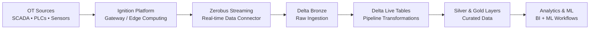

## Ignition Zerobus Connector

**Version**: `1.0.0`  
**Purpose**: Stream Ignition tag-change events to Databricks Delta tables via Zerobus (gRPC + protobuf).  
**Ignition compatibility**: **8.1.x** and **8.3.x** (different `.modl` artifacts).  
**Configuration**: via the **Ignition Gateway UI**.

## Source-agnostic by design (OPC UA, MQTT, and more)

This connector is **agnostic to the underlying OT/IIoT source** because it subscribes to **Ignition tags**, not to a specific protocol.

- **Ignition normalizes sources into tags**: Whether values originate from **OPC UA**, **MQTT**, PLC drivers, historians, or other tag providers, Ignition exposes them through the same Tag system and emits the same tag-change callbacks.
- **Stable event schema**: The module converts a tag change into a single protobuf message (see `module/src/main/proto/ot_event.proto`). Since the event payload is **about the tag observation** (tag path, timestamp, value, quality, etc.), **you do not change protobuf/schema when you switch protocols**—you only change which tag paths you subscribe to.

### What changes when you switch sources?

Only the **tag provider** (the left-most portion of the tag path) and the tag paths you select.

Examples (illustrative):
- **OPC UA tags**:
  - `[MyOpcUa]Devices/Turbine1/Speed`
  - `[MyOpcUa]Devices/Turbine1/Temperature`
- **MQTT tags (via MQTT Engine / Transmission providers)**:
  - `[MQTT Engine]Sparkplug B/Group/Edge Node/Device/pressure`
  - `[MQTT Engine]Sparkplug B/Group/Edge Node/Device/vibration_rms`
- **Simulated/demo tags**:
  - `[Sample_Tags]Sine/Sine0`
  - `[Sample_Tags]Ramp/Ramp0`

In all cases, the connector publishes **the same protobuf event type** to Databricks and writes into the same Delta table schema.

## Reference architecture



## Table of contents

- [Repository layout](#repository-layout)
- [Release artifacts (two `.modl` files)](#release-artifacts-two-modl-files)
- [Developer build](#developer-build)
- [Reference](#reference)

For production setup (prereqs, install, configure, verify, troubleshooting), see `DEPLOYMENT.md`.

## Repository layout

Canonical locations:
- **Module source/build**: `module/`
- **Published module artifacts (`.modl`)**: `releases/` (repo root)

Directory structure (high-level):

```text
.
├── README.md
├── DEPLOYMENT.md
├── releases/                       # canonical .modl artifacts (root)
│   ├── zerobus-connector-1.0.0.modl
│   └── zerobus-connector-1.0.0-ignition-8.3.modl
├── module/                         # Ignition module source + Gradle build
│   ├── build.gradle
│   ├── settings.gradle
│   ├── gradlew
│   └── src/
│       └── main/
│           ├── java/               # gateway hooks, services, servlet layer
│           ├── resources/          # module.xml, i18n, UI assets (web/, mounted/)
│           └── proto/              # protobuf schema (ot_event.proto)
└── onboarding/
    ├── databricks/                 # optional: helper to create/align target table schema
    └── ignition/
        ├── 8.1.50/README.md
        └── 8.3.2/README.md
```

## Release artifacts (two `.modl` files)

There are **two** prebuilt module packages under `releases/`:

- **`releases/zerobus-connector-1.0.0.modl`**:
  - **Install on**: Ignition **8.1.x** (and 8.2.x if you run it)
  - **Why**: the packaged `module.xml` sets `<requiredIgnitionVersion>` to `8.1.0`

- **`releases/zerobus-connector-1.0.0-ignition-8.3.modl`**:
  - **Install on**: Ignition **8.3.x**
  - **Why**: the packaged `module.xml` sets `<requiredIgnitionVersion>` to `8.3.0`

### What’s different between them?

Ignition enforces compatibility based on `module.xml` during install. Because 8.3 refuses modules whose `requiredIgnitionVersion` is below 8.3, we ship two `.modl` artifacts.

The **runtime behavior and code are the same**; the important differences are:

- **`module.xml` gate**: different `<requiredIgnitionVersion>` value, produced by the Gradle `-PminIgnitionVersion=...` build flag.
- **Servlet API at runtime**:
  - Ignition 8.1 uses **`javax.servlet`**
  - Ignition 8.3 uses **`jakarta.servlet`**
  - The module includes both servlet implementations and selects the right one at runtime via `module/src/main/java/com/example/ignition/zerobus/web/ZerobusConfigServlet.java`.

## Developer build

### 1) Prerequisites (local dev machine)

- **JDK 17** installed (Gradle/tooling).
- **Ignition SDK jars available locally** (used as `compileOnly` dependencies):
  - **8.1.x** install at: `/usr/local/ignition8.1`
  - **8.3.x** install at: `/usr/local/ignition`

### 2) Code flow explainer (runtime)

#### 2.1) High-level architecture

Two ways for events to enter the module:
- **Direct subscriptions** (recommended): in-JVM tag change callbacks from Ignition’s TagManager
- **HTTP ingest** (ingest-only mode): external producer POSTs JSON to module endpoints

One way for events to leave the module:
- **Zerobus ingest over gRPC/protobuf** to the Databricks Zerobus endpoint

#### 2.2) Lifecycle and configuration

**Startup**
- Gateway hook entrypoints:
  - Ignition **8.1.x**: `com.example.ignition.zerobus.ZerobusGatewayHook`
  - Ignition **8.3.x**: `com.example.ignition.zerobus.ZerobusGatewayHook83`
- PersistentRecord schema is registered (tables created if missing).
- Configuration is loaded from the Gateway internal DB into `com.example.ignition.zerobus.ConfigModel`.
- Services start **only if** configuration is valid enough to run (and module is enabled). Invalid config **does not fault the module**; it keeps services stopped and exposes the error in diagnostics.

**Save/apply configuration**
- New values are persisted to PersistentRecord.
- Runtime `ConfigModel` is updated (`updateFrom(...)`).
- Services are restarted only if necessary (and without crashing the module on validation errors).
- OAuth client secret is stored in the Gateway internal DB (masked in UI); leaving it blank preserves the existing value.

#### 2.3) Data path: Direct subscriptions mode

1) **Tag change happens**: Ignition calls into the module via TagManager subscription callbacks.  
2) **Module enqueues events**: `TagSubscriptionService` converts the change to internal `TagEvent` objects and pushes them onto a bounded queue.  
3) **Batch/flush loop**: flushes based on `batchSize` and `batchFlushIntervalMs` (plus rate limits/backpressure).  
4) **Send to Databricks via Zerobus**: `ZerobusClientManager` converts events to protobuf (`module/src/main/proto/ot_event.proto`) and streams them over gRPC to Databricks Zerobus (with reconnect/recovery on transient failures).

#### 2.4) Data path: HTTP ingest mode (ingest-only)

Prerequisite: set **Enable Direct Subscriptions** = OFF in the module UI.

1) **Producer POSTs JSON**:
   - `POST /system/zerobus/ingest` (single)
   - `POST /system/zerobus/ingest/batch` (batch)
2) **Servlet routes the request**:
   - `.../web/ZerobusConfigServlet` (dispatcher)
   - `.../web/ZerobusServletHandler` (shared request parsing/routing)
3) **Events are enqueued**: same queue as direct subscriptions.
4) **Batch/flush/send**: same flush loop and Zerobus sender as direct subscriptions.

### 3) Build artifacts

#### 3.1) Build the Ignition 8.1.x module (`.modl`)

```bash
cd module
JAVA_HOME=/opt/homebrew/opt/openjdk@17 PATH=/opt/homebrew/opt/openjdk@17/bin:$PATH \
  ./gradlew buildModule81
```

Output: `module/build-user-8.1/modules/zerobus-connector-1.0.0.modl`

#### 3.2) Build the Ignition 8.3.x module (`.modl`)

```bash
cd module
JAVA_HOME=/opt/homebrew/opt/openjdk@17 PATH=/opt/homebrew/opt/openjdk@17/bin:$PATH \
  ./gradlew buildModule83
```

Output: `module/build-user-8.3/modules/zerobus-connector-1.0.0-ignition-8.3.modl`

#### 3.3) Where release artifacts go

After building, the Gradle task also copies the `.modl` into the repo-level `releases/` directory.

### 4) Local testing (run Ignition gateways)

#### 4.1) Install prerequisites

- Install **Ignition 8.1.x** and/or **Ignition 8.3.x** locally.
- Install **JDK 17** (required for building the module).

#### 4.2) Where the Gateway port is configured

On a default local install, the HTTP port is configured in:
- **Ignition 8.3.x**: `/usr/local/ignition/data/ignition.conf`
- **Ignition 8.1.x**: `/usr/local/ignition8.1/data/ignition.conf`

To see what port is currently set:

```bash
grep -E '^(webserver\\.http\\.port|webserver\\.https\\.port)=' /usr/local/ignition/data/ignition.conf
grep -E '^(webserver\\.http\\.port|webserver\\.https\\.port)=' /usr/local/ignition8.1/data/ignition.conf
```

#### 4.3) Start / stop / status commands

Ignition installs include an `ignition.sh` control script:

```bash
# Ignition 8.3.x
/usr/local/ignition/ignition.sh start
/usr/local/ignition/ignition.sh stop
/usr/local/ignition/ignition.sh status

# Ignition 8.1.x
/usr/local/ignition8.1/ignition.sh start
/usr/local/ignition8.1/ignition.sh stop
/usr/local/ignition8.1/ignition.sh status
```

If you run into permissions errors starting/stopping, run the same commands with `sudo`.

## Reference

### API endpoints

All endpoints are under `/system/zerobus`:
- `GET /health`
- `GET /diagnostics`
- `POST /config`
- `POST /test-connection`
- `POST /ingest` (single JSON event)
- `POST /ingest/batch` (JSON array of events)

### Key classes

- **`module/src/main/java/com/example/ignition/zerobus/ZerobusGatewayHook.java`**: module lifecycle; loads/saves config; starts/stops services; registers HTTP endpoints under `/system/zerobus/*`.
- **`module/src/main/java/com/example/ignition/zerobus/TagSubscriptionService.java`**: tag event processing:
  - direct mode subscriptions via TagManager
  - HTTP ingest queueing via `/ingest` and `/ingest/batch`
  - batching + rate limiting + flush loop
- **`module/src/main/java/com/example/ignition/zerobus/ZerobusClientManager.java`**: manages Zerobus client; converts events to protobuf and streams to Databricks.
- **Servlet compatibility layer**:
  - `.../web/ZerobusConfigServlet.java` selects `javax` vs `jakarta` servlet implementation at runtime.
  - `.../web/ZerobusServletHandler.java` holds shared request parsing and routing.
- **Schema**: `module/src/main/proto/ot_event.proto`

### End-to-end data flow

**Direct subscriptions**
1) Tag change event → `TagSubscriptionService` listener  
2) Convert to internal `TagEvent` → queue  
3) Flush loop batches → `ZerobusClientManager`  
4) Protobuf (OTEvent) → Zerobus stream → Delta

**HTTP ingest (Event Streams / external producer)**
1) Producer POSTs JSON → `/system/zerobus/ingest` or `/ingest/batch`  
2) Handler parses + enqueues `TagEvent`s  
3) Batching + streaming as above
