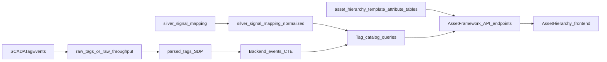

# Asset Framework Data Flow

This document explains how the asset framework frontend maps to backend APIs,
asset framework tables, and Lakeflow Spark Declarative Pipeline outputs.

## Ownership Matrix

| Layer | Owns | Reads From | Writes To | Notes |
|---|---|---|---|---|
| Frontend (`AssetHierarchy`) | UI state, tree rendering, tag explorer interactions | Backend API | None | No direct Databricks table access |
| Backend API (`/api/asset-framework/...`) | Query orchestration and response shape | `asset_hierarchy`, `template_attributes`, `asset_attribute_values`, `silver_signal_mapping_normalized`, `parsed_tags` (or `raw_tags` fallback) | Asset framework CRUD endpoints write AF tables | Main translation layer for UI-to-data |
| Asset Framework tables | Canonical asset model and metadata | N/A | Setup SQL and backend CRUD | `asset_hierarchy` is the source of truth for hierarchy |
| SDP / Lakeflow pipeline | Streaming telemetry shaping and parsing | `raw_throughput` | `parsed_tags`, `enriched_tags`, other downstream tables | Supplies fast telemetry context for app queries |
| Mapping bridge view | Normalized tag-to-hierarchy keys | `silver_signal_mapping` | `silver_signal_mapping_normalized` (view) | Aligns legacy mapping with hierarchy IDs and normalized tag names |

## Runtime Data Flow

## Endpoint to Data Mapping

- `GET /api/asset-framework/hierarchy`
  - Query: `hierarchy`
  - Source: `asset_hierarchy`
  - Purpose: tree structure, depth, child counts

- `GET /api/asset-framework/hierarchy/tag-summary`
  - Query: `hierarchyAssetTagSummary`
  - Sources:
    - `silver_signal_mapping_normalized`
    - `events` CTE (`parsed_tags` when `USE_PARSED_TAGS=true`; otherwise parsed `raw_tags`)
  - Purpose: mapped/live/unmapped counts for tree badges

- `GET /api/asset-framework/hierarchy/{asset_id}/tags`
  - Query: `hierarchyAssetTags`
  - Sources:
    - `silver_signal_mapping_normalized` for canonical mapped tags
    - `events` CTE for latest values and quality
  - Purpose: asset-level tag catalog and inspector data

- `GET /api/asset-framework/hierarchy/{asset_id}/attributes`
  - Query: `assetAttrValues`
  - Sources: `asset_attribute_values`, `template_attributes`
  - Purpose: template-bound static attribute values

- `GET /api/asset-framework/hierarchy/{asset_id}/live-attributes`
  - Query: `assetLiveAttrValues`
  - Sources:
    - `asset_attribute_values`, `template_attributes`
    - `events` CTE for latest live telemetry by `tag_pattern`
  - Purpose: live values for template-bound attributes

## Key Contracts

- Asset ID normalization:
  - `lower(location + "_" + asset)` from SCADA tag path
  - Must match hierarchy IDs in `asset_hierarchy`

- Tag name normalization:
  - `lower(subsystem + "/" + signal)` from SCADA tag path
  - Must match `normalized_tag_name` in `silver_signal_mapping_normalized`

- Event source preference:
  - Backend reads `parsed_tags` if `USE_PARSED_TAGS=true`
  - Falls back to on-the-fly parsing of `raw_tags` when disabled

## Troubleshooting

- Tag explorer returns no tags:
  - Confirm `parsed_tags` has fresh rows for the asset.
  - Validate `USE_PARSED_TAGS` setting in app environment.
  - Verify selected asset ID matches parsed telemetry asset ID format.

- Many tags show as unmapped:
  - Check `silver_signal_mapping` coverage for incoming `tag_path` values.
  - Verify `silver_signal_mapping_normalized` parses expected `hierarchy_asset_id`.
  - Confirm normalized tag names match SCADA subsystem/signal path format.

- Tree badges show unexpected counts:
  - Ensure lookback window in `/hierarchy/tag-summary` includes active telemetry.
  - Check for case or separator mismatches in tag naming.
  - Verify mapping rows are active (`active = true`).

- Attribute live values are empty while tag explorer has values:
  - Check `template_attributes.tag_pattern` values for exact match to normalized tag names.
  - Confirm the asset has template attributes instantiated in `asset_attribute_values`.
